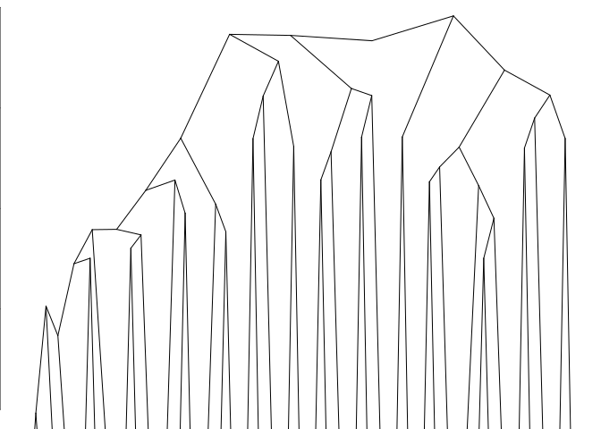

adjclust: Adjacency-constrained clustering
==========================================

`adjclust` is a package that provides methods to perform adjacency-constrained hierarchical agglomerative clustering. Adjacency-constrained hierarchical agglomerative clustering is hierarchical agglomerative clustering (HAC) in which each observation is associated to a position, and the clustering is constrained so as only adjacent clusters are merged. It is useful in bioinformatics (e.g. Genome Wide Association Studies or Hi-C data analysis).

`adjclust` provides three user level functions: `adjClust`, `snpClust` and `hicClust`, which are briefly explained below.

Installation
------------

You can install adjclust from github with:

``` r
# install.packages("devtools")
devtools::install_github("pneuvial/adjclust")
```

`adjClust`
----------

`adjClust` performs adjacency-constrained HAC for standard and sparse, similarity and dissimilarity matrices and `dist` objects. `Matrix::dgCMatrix` and `Matrix::dsCMatrix` are the supported sparse matrix classes. Let's look at a basic example

``` r
library("adjclust")

sim <- matrix(c(1.0, 0.5, 0.2, 0.1,
                0.5, 1.0, 0.1, 0.2,
                0.2, 0.1, 1.0, 0.6,
                0.1, 0.2 ,0.6 ,1.0), nrow=4)
h <- 3
fit <- adjClust(sim, "similarity", h)
plot(fit)
```


The result is of class `chac`. It can be plotted as a dendogram (as shown above). Successive merge and heights of clustering can be obtained by `fit$merge` and `fit$height` respectively.

`snpClust`
----------

`snpClust` performs adjacency-constrained HAC for specific application of Genome Wide Association Studies (GWAS). A minimal example is given below. See [GWAS Vignette](vignettes/snpClust.Rmd) for details.

``` r
library("snpStats")
#> Loading required package: survival
#> Loading required package: Matrix
data("ld.example", package = "snpStats")
geno <- ceph.1mb[, -316]  ## drop one SNP leading to one missing LD value
h <- 100
ld.ceph <- ld(geno, stats = "R.squared", depth = h)
image(ld.ceph, lwd = 0)
```


``` r

fit <- snpClust(geno, stats = "R.squared", h = h)
plot(fit)
```


`hicClust`
----------

`hicClust` performs adjacency-constrained HAC for specific application of Hi-C data analysis. A minimal example is given below. See [Hi-C Vignette](vignettes/hicClust.Rmd) for details.

``` r
library("HiTC")
```

``` r
data("hic_imr90_40_XX", package = "adjclust")
binned <- binningC(hic_imr90_40_XX, binsize = 5e5)
#> Bin size 'xgi' =501579 [1x501579]
#> Bin size 'ygi' =501579 [1x501579]
mapC(binned)
#> minrange= 12  - maxrange= 1022
```


``` r

fitB <- hicClust(binned)
plot(fitB)
```



Credits
-------

Version 0.4.0 of this package was completed by Shubham Chaturvedi as a part of the [Google Summer of Code 2017](https://summerofcode.withgoogle.com/projects/#4961904920363008) program.
