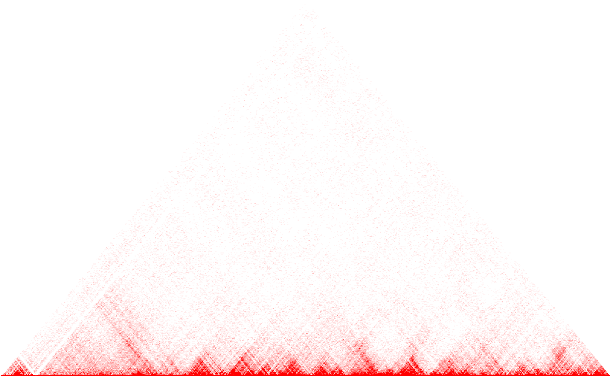
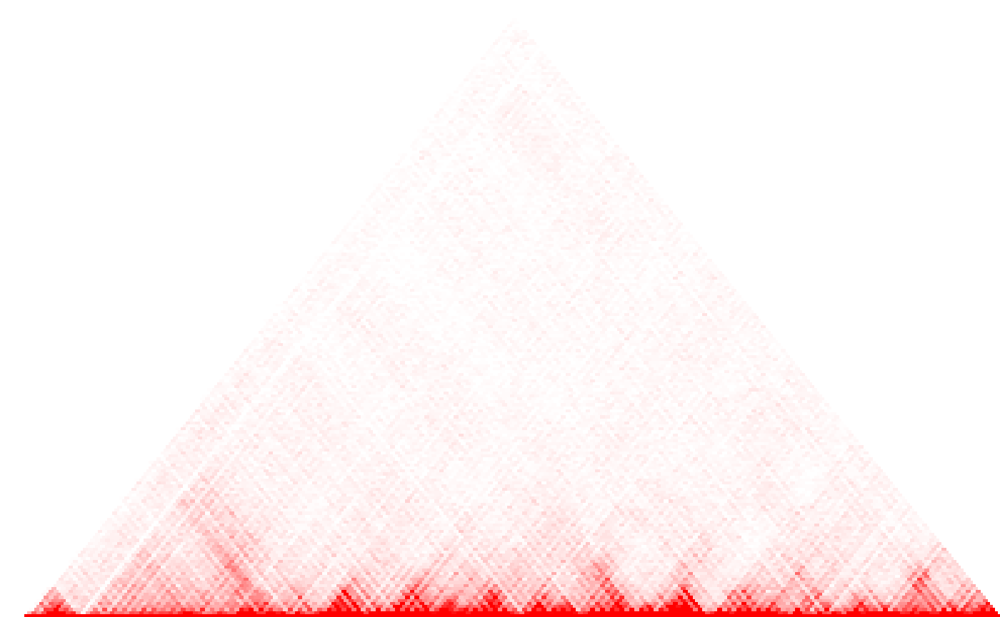
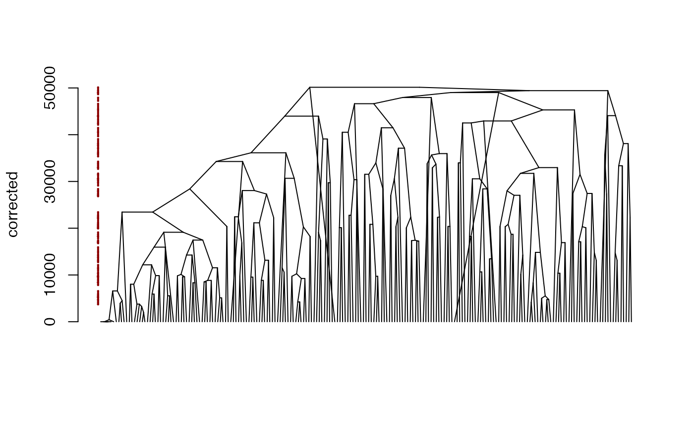

# Clustering of Hi-C contact maps

``` r
# IMPORTANT: this vignette can not be created if HiTC is not installed
if (!require("HiTC", quietly = TRUE)) {
  knitr::opts_chunk$set(eval = FALSE)
}
```

    ## 
    ## Attaching package: 'generics'

    ## The following objects are masked from 'package:base':
    ## 
    ##     as.difftime, as.factor, as.ordered, intersect, is.element, setdiff,
    ##     setequal, union

    ## 
    ## Attaching package: 'BiocGenerics'

    ## The following objects are masked from 'package:stats':
    ## 
    ##     IQR, mad, sd, var, xtabs

    ## The following objects are masked from 'package:base':
    ## 
    ##     anyDuplicated, aperm, append, as.data.frame, basename, cbind,
    ##     colnames, dirname, do.call, duplicated, eval, evalq, Filter, Find,
    ##     get, grep, grepl, is.unsorted, lapply, Map, mapply, match, mget,
    ##     order, paste, pmax, pmax.int, pmin, pmin.int, Position, rank,
    ##     rbind, Reduce, rownames, sapply, saveRDS, table, tapply, unique,
    ##     unsplit, which.max, which.min

    ## 
    ## Attaching package: 'S4Vectors'

    ## The following object is masked from 'package:utils':
    ## 
    ##     findMatches

    ## The following objects are masked from 'package:base':
    ## 
    ##     expand.grid, I, unname

## Introduction

Hi-C is a sequencing-based molecular assay designed to measure intra and
inter-chromosomal interactions between the DNA molecule. In particular,
the identification of Topologically-Associated Domains (TADs), that is,
of regions of the genome in which physical interactions are frequent,
provides insight into the three-dimensional organization of a genome
\[2\].

Hi-C data are in the form of two-dimensional *contact maps*, *i.e.*,
matrices whose $i,j$ entry quantifies the intensity of the physical
interaction between two genome regions $i$ and $j$ at the DNA level. In
this vignette, we demonstrate the use of
[`adjclust::hicClust`](https://pneuvial.github.io/adjclust/reference/hicClust.md)
to perform adjacency-constrained hierarchical agglomerative clustering
(HAC) of Hi-C contact maps. The output of this function is a dendrogram,
which can be cut to identify TADs. The algorithm used for
adjacency-constrained (HAC) is described in \[3,4\].

``` r
library("adjclust")
```

## Loading and displaying a sample Hi-C contact map

The data set `hic_imr90_40_XX` is an object of class `HTCexp` which has
been obtained from the `HiTC` package \[4\]. It is a contact map
corresponding to the first 500 x 500 bins on chromosome X vs chromosome
X.

``` r
load(system.file("extdata", "hic_imr90_40_XX.rda", package = "adjclust"))
```

The script used to create this map can be found by executing the
following command:

``` r
system.file("system/create_hic_chrXchrX.R", package="adjclust")
```

    ## [1] "/home/runner/work/_temp/Library/adjclust/system/create_hic_chrXchrX.R"

Now we have a look at the data.

``` r
HiTC::mapC(hic_imr90_40_XX)
```



## Using `hicClust`

`hicClust` operates directly on objects of class `HTCexp`

``` r
fit <- hicClust(hic_imr90_40_XX)
```

It is also possible to work on binned data. Below we choose a bin size
of $5 \times 10^{5}$:

``` r
binned <- HiTC::binningC(hic_imr90_40_XX, binsize = 1e5)
fitB <- hicClust(binned)
fitB
```

    ## 
    ## Call:
    ## hicClust(binned)
    ## 
    ## Cluster method   : hicClust 
    ## Number of objects: 205

``` r
HiTC::mapC(binned)
```



The output is of class `chac`. In particular, it can be plotted as a
dendrogram silently relying on the function `plot.dendrogram`:

``` r
plot(fitB, mode = "corrected")
```



Moreover, the output contains an element named `merge` which describes
the successive merges of the clustering, and an element `gains` which
gives the improvement in the criterion optimized by the clustering at
each successive merge.

``` r
head(cbind(fitB$merge, fitB$gains))
```

    ##      [,1] [,2]
    ## [1,]   -3   -4
    ## [2,]   -2    1
    ## [3,]    2   -5
    ## [4,]   -1    3
    ## [5,]    4   -6
    ## [6,]  -17  -18

## Other types of input

Contacts maps can also be stored as objects of class
`Matrix::dsCMatrix`, or as plain text files. These types of input are
also accepted as first argument to `hicClust`.

## References

\[1\] Ambroise C., Dehman A., Neuvial P., Rigaill G., and Vialaneix N.
(2019). Adjacency-constrained hierarchical clustering of a band
similarity matrix with application to genomics. *Algorithms for
Molecular Biology*, **14**, 22.

\[2\] Dixon J.R., *et al* (2012). Topological domains in mammalian
genomes identified by analysis of chromatin interactions. *Nature*,
**485**(7398), 376.

\[3\] Randriamihamison N., Vialaneix N., and Neuvial P. (2021).
Applicability and interpretability of Ward’s hierarchical agglomerative
clustering with or without contiguity constraints. *Journal of
Classification*, **38**, 363–389.

\[4\] Servant N., *et al* (2012). HiTC: Exploration of High-Throughput
‘C’ experiments. *Bioinformatics*, **28**(21), 2843-2844.

## Session information

``` r
sessionInfo()
```

    ## R version 4.5.2 (2025-10-31)
    ## Platform: x86_64-pc-linux-gnu
    ## Running under: Ubuntu 24.04.3 LTS
    ## 
    ## Matrix products: default
    ## BLAS:   /usr/lib/x86_64-linux-gnu/openblas-pthread/libblas.so.3 
    ## LAPACK: /usr/lib/x86_64-linux-gnu/openblas-pthread/libopenblasp-r0.3.26.so;  LAPACK version 3.12.0
    ## 
    ## locale:
    ##  [1] LC_CTYPE=C.UTF-8       LC_NUMERIC=C           LC_TIME=C.UTF-8       
    ##  [4] LC_COLLATE=C.UTF-8     LC_MONETARY=C.UTF-8    LC_MESSAGES=C.UTF-8   
    ##  [7] LC_PAPER=C.UTF-8       LC_NAME=C              LC_ADDRESS=C          
    ## [10] LC_TELEPHONE=C         LC_MEASUREMENT=C.UTF-8 LC_IDENTIFICATION=C   
    ## 
    ## time zone: UTC
    ## tzcode source: system (glibc)
    ## 
    ## attached base packages:
    ## [1] stats4    stats     graphics  grDevices utils     datasets  methods  
    ## [8] base     
    ## 
    ## other attached packages:
    ## [1] adjclust_0.6.11      HiTC_1.54.0          GenomicRanges_1.62.0
    ## [4] Seqinfo_1.0.0        IRanges_2.44.0       S4Vectors_0.48.0    
    ## [7] BiocGenerics_0.56.0  generics_0.1.4      
    ## 
    ## loaded via a namespace (and not attached):
    ##  [1] SummarizedExperiment_1.40.0 capushe_1.1.3              
    ##  [3] gtable_0.3.6                rjson_0.2.23               
    ##  [5] xfun_0.54                   bslib_0.9.0                
    ##  [7] ggplot2_4.0.1               Biobase_2.70.0             
    ##  [9] lattice_0.22-7              vctrs_0.6.5                
    ## [11] tools_4.5.2                 bitops_1.0-9               
    ## [13] curl_7.0.0                  parallel_4.5.2             
    ## [15] Matrix_1.7-4                RColorBrewer_1.1-3         
    ## [17] sparseMatrixStats_1.22.0    S7_0.2.1                   
    ## [19] desc_1.4.3                  cigarillo_1.0.0            
    ## [21] lifecycle_1.0.4             compiler_4.5.2             
    ## [23] farver_2.1.2                Rsamtools_2.26.0           
    ## [25] textshaping_1.0.4           Biostrings_2.78.0          
    ## [27] codetools_0.2-20            htmltools_0.5.8.1          
    ## [29] sass_0.4.10                 RCurl_1.98-1.17            
    ## [31] yaml_2.3.10                 pkgdown_2.2.0              
    ## [33] crayon_1.5.3                jquerylib_0.1.4            
    ## [35] MASS_7.3-65                 BiocParallel_1.44.0        
    ## [37] cachem_1.1.0                DelayedArray_0.36.0        
    ## [39] viridis_0.6.5               abind_1.4-8                
    ## [41] digest_0.6.39               restfulr_0.0.16            
    ## [43] fastmap_1.2.0               grid_4.5.2                 
    ## [45] cli_3.6.5                   SparseArray_1.10.2         
    ## [47] magrittr_2.0.4              S4Arrays_1.10.0            
    ## [49] XML_3.99-0.20               scales_1.4.0               
    ## [51] rmarkdown_2.30              XVector_0.50.0             
    ## [53] httr_1.4.7                  matrixStats_1.5.0          
    ## [55] gridExtra_2.3               ragg_1.5.0                 
    ## [57] evaluate_1.0.5              knitr_1.50                 
    ## [59] BiocIO_1.20.0               viridisLite_0.4.2          
    ## [61] rtracklayer_1.70.0          rlang_1.1.6                
    ## [63] dendextend_1.19.1           Rcpp_1.1.0                 
    ## [65] glue_1.8.0                  jsonlite_2.0.0             
    ## [67] R6_2.6.1                    MatrixGenerics_1.22.0      
    ## [69] GenomicAlignments_1.46.0    systemfonts_1.3.1          
    ## [71] fs_1.6.6
