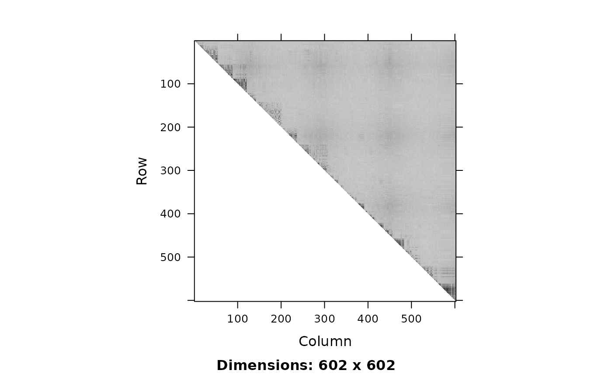
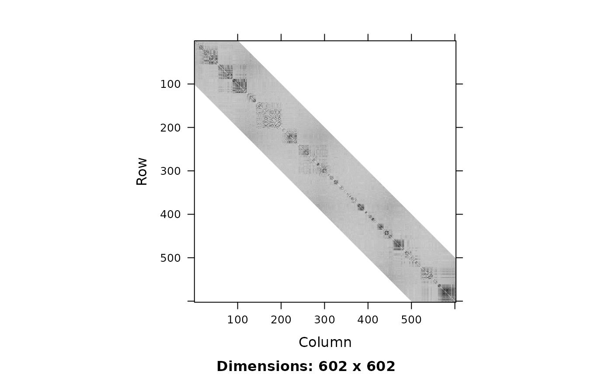

# Inferring Linkage Disequilibrium blocks from genotypes

``` r
# IMPORTANT: this vignette is not created if snpStats is not installed
if (!require("snpStats")) {
  knitr::opts_chunk$set(eval = FALSE)
}
```

    ## Loading required package: snpStats

    ## Loading required package: survival

    ## Loading required package: Matrix

## Introduction

In this vignette we demonstrate the use of `snpClust` function in the
`adjclust` package. `snpClust` performs adjacency-constrained
hierarchical clustering of single nucleotide polymorphisms (SNPs), where
the similarity between SNPs is defined by linkage disequilibrium (LD).

This function implements the algorithm described in \[1\]. It is an
extension of the algorithm described in \[3,4\]. Denoting by $p$ the
number of SNPs to cluster and assuming that the similarity between SNPs
whose indices are more distant than $h$, its time complexity is
$O\left( p\left( \log(p) + h \right) \right)$, and its space complexity
is $O(hp)$.

``` r
library("adjclust")
```

## Loading and displaying genotype data

The beginning of this vignette closely follows the “LD vignette” of the
SnpStats package \[2\]. First, we load genotype data.

``` r
data("ld.example", package = "snpStats")
```

We focus on the `ceph.1mb` data.

``` r
geno <- ceph.1mb[, -316]  ## drop one SNP leading to one missing LD value
p <- ncol(geno)
nSamples <- nrow(geno)
geno
```

    ## A SnpMatrix with  90 rows and  602 columns
    ## Row names:  NA06985 ... NA12892 
    ## Col names:  rs5993821 ... rs5747302

These data are drawn from the International HapMap Project and concern
602 SNPs[¹](#fn1) over a 1Mb region of chromosome 22 in sample of 90
Europeans.

We can compute and display the LD between these SNPs.

``` r
ld.ceph <- snpStats::ld(geno, stats = "R.squared", depth = p-1)
image(ld.ceph, lwd = 0)
```



## Adjacency-constrained Hierarchical Agglomerative Clustering

The `snpClust` function can handle genotype data as an input:

``` r
fit <- snpClust(geno, stats = "R.squared")
```

    ## Warning in run.snpClust(x, h = h, stats = stats): Forcing the LD similarity to
    ## be smaller than or equal to 1

    ## Note: 135 merges with non increasing heights.

Note that due to numerical errors in the LD estimation, some of the
estimated LD values may be slightly larger than 1. These values are
rounded to 1 internally.

The above figure suggests that the LD signal is concentrated close to
the diagonal. We can focus on a diagonal band with the bandwidth
parameter `h`:

``` r
fitH <- snpClust(geno, h = 100, stats = "R.squared")
```

    ## Warning in run.snpClust(x, h = h, stats = stats): Forcing the LD similarity to
    ## be smaller than or equal to 1

    ## Note: 133 merges with non increasing heights.

``` r
fitH
```

    ## 
    ## Call:
    ## snpClust(geno, h = 100, stats = "R.squared")
    ## 
    ## Cluster method   : snpClust 
    ## Number of objects: 602

## Output

The output of the `snpClust` is of class `chac`. In particular, it can
be plotted as a dendrogram silently relying on the function
`plot.dendrogram`:

``` r
plot(fitH, type = "rectangle", leaflab = "perpendicular")
```

    ## Warning: 
    ## Detected reversals in dendrogram: mode = 'corrected', 'within-disp' or 'total-disp' might be more relevant.


Moreover, the output contains an element named `merge` which describes
the successive merges of the clustering, and an element `gains` which
gives the improvement in the criterion optimized by the clustering at
each successive merge.

``` r
head(cbind(fitH$merge, fitH$gains))
```

    ##      [,1] [,2]
    ## [1,]   -1   -2
    ## [2,] -255 -256
    ## [3,] -488 -489
    ## [4,] -487    3
    ## [5,] -486    4
    ## [6,] -234 -235

## Other types of input

In this section we show how the `snpClust` function can also be applied
directly to LD values.

``` r
h <- 100
ld.ceph <- snpStats::ld(geno, stats = "R.squared", depth = h, symmetric = TRUE)
image(ld.ceph, lwd = 0)
```



Note that we have forced the
[`snpStats::ld`](https://rdrr.io/pkg/snpStats/man/ld.html) function to
return a symmetric matrix. We can apply `snpClust` directly to this LD
matrix (of class `Matrix::dsCMatrix`):

``` r
fitL <- snpClust(ld.ceph, h)
```

    ## Note: forcing the diagonal of the LD similarity matrix to be 1

    ## Warning in run.snpClust(x, h = h, stats = stats): Forcing the LD similarity to
    ## be smaller than or equal to 1

    ## Note: 133 merges with non increasing heights.

`snpClust` also handles inputs of class
[`base::matrix`](https://rdrr.io/r/base/matrix.html):

``` r
gmat <- as(geno, "matrix")
fitM <- snpClust(geno, h, stats = "R.squared")
```

    ## Note: 133 merges with non increasing heights.

## References

\[1\] Ambroise C., Dehman A., Neuvial P., Rigaill G., and Vialaneix N.
(2019). Adjacency-constrained hierarchical clustering of a band
similarity matrix with application to genomics. *Algorithms for
Molecular Biology*, **14**, 22.

\[2\] Clayton D. (2015). snpStats: SnpMatrix and XSnpMatrix classes and
methods. R package version 1.20.0

\[3\] Dehman A., Ambroise C., Neuvial P. (2015). Performance of a
blockwise approach in variable selection using linkage disequilibrium
information. *BMC Bioinformatics*, **16**, 148.

\[4\] Randriamihamison N., Vialaneix N., and Neuvial P. (2021).
Applicability and interpretability of Ward’s hierarchical agglomerative
clustering with or without contiguity constraints. *Journal of
Classification*, **38**, 363–389.

## Session information

``` r
sessionInfo()
```

    ## R version 4.5.2 (2025-10-31)
    ## Platform: x86_64-pc-linux-gnu
    ## Running under: Ubuntu 24.04.3 LTS
    ## 
    ## Matrix products: default
    ## BLAS:   /usr/lib/x86_64-linux-gnu/openblas-pthread/libblas.so.3 
    ## LAPACK: /usr/lib/x86_64-linux-gnu/openblas-pthread/libopenblasp-r0.3.26.so;  LAPACK version 3.12.0
    ## 
    ## locale:
    ##  [1] LC_CTYPE=C.UTF-8       LC_NUMERIC=C           LC_TIME=C.UTF-8       
    ##  [4] LC_COLLATE=C.UTF-8     LC_MONETARY=C.UTF-8    LC_MESSAGES=C.UTF-8   
    ##  [7] LC_PAPER=C.UTF-8       LC_NAME=C              LC_ADDRESS=C          
    ## [10] LC_TELEPHONE=C         LC_MEASUREMENT=C.UTF-8 LC_IDENTIFICATION=C   
    ## 
    ## time zone: UTC
    ## tzcode source: system (glibc)
    ## 
    ## attached base packages:
    ## [1] stats     graphics  grDevices utils     datasets  methods   base     
    ## 
    ## other attached packages:
    ## [1] adjclust_0.6.11 snpStats_1.60.0 Matrix_1.7-4    survival_3.8-3 
    ## 
    ## loaded via a namespace (and not attached):
    ##  [1] dendextend_1.19.1        gtable_0.3.6             jsonlite_2.0.0          
    ##  [4] compiler_4.5.2           Rcpp_1.1.0               gridExtra_2.3           
    ##  [7] jquerylib_0.1.4          splines_4.5.2            systemfonts_1.3.1       
    ## [10] scales_1.4.0             textshaping_1.0.4        yaml_2.3.10             
    ## [13] fastmap_1.2.0            lattice_0.22-7           ggplot2_4.0.1           
    ## [16] R6_2.6.1                 generics_0.1.4           knitr_1.50              
    ## [19] viridis_0.6.5            BiocGenerics_0.56.0      MASS_7.3-65             
    ## [22] MatrixGenerics_1.22.0    desc_1.4.3               bslib_0.9.0             
    ## [25] RColorBrewer_1.1-3       rlang_1.1.6              cachem_1.1.0            
    ## [28] capushe_1.1.3            xfun_0.54                fs_1.6.6                
    ## [31] sass_0.4.10              S7_0.2.1                 viridisLite_0.4.2       
    ## [34] cli_3.6.5                pkgdown_2.2.0            magrittr_2.0.4          
    ## [37] digest_0.6.39            grid_4.5.2               sparseMatrixStats_1.22.0
    ## [40] lifecycle_1.0.4          vctrs_0.6.5              evaluate_1.0.5          
    ## [43] glue_1.8.0               farver_2.1.2             ragg_1.5.0              
    ## [46] rmarkdown_2.30           matrixStats_1.5.0        tools_4.5.2             
    ## [49] htmltools_0.5.8.1

------------------------------------------------------------------------

1.  We have dropped SNP rs2401075 because it produced a missing value
    due to the lack of genetic diversity in the considered sample.
